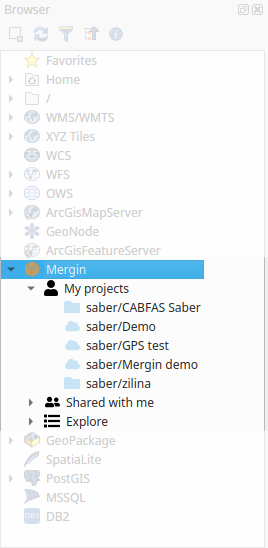
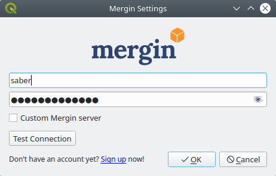
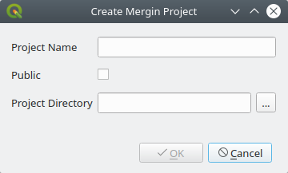

# User documentation

## Installation
To use Mergin plugin, you will need to:
- Sign up with Mergin service: https://public.cloudmergin.com/
- Install the plugin from QGIS plugin manager

Once, you have installed the plugin, a new provider will appear in your QGIS Browser panel.

**Note 1**: that there is no menu entry or toolbar icons for Mergin plugin. The only method to interact with the service is through the QGIS Browser panel.

**Note 2**: You may need to restart your QGIS to see Mergin in your QGIS browser panel after the installation.

To be able to view Mergin projects, we need to sign in:

1. In the browser panel, right-click on Mergin
2. Select **Configure**
3. A new window will appear:
  - For **Username**: type your Mergin username
  - For **Password**: type your Mergin password
  - Click **Test Connection** and it should show OK.
4. Click **OK**

**Note 3**: the default URL for the Mergin service is set to https://public.cloudmergin.com/. You can change that, by selecting **Custom Mergin server**.

To view the list of your projects, click on the arrow to the right of Mergin in your QGIS browser panel.

## Using Mergin plugin
The following functionalities are available from Mergin plugin:

### Create a new project
You can start a new project by right-clicking on Mergin from the browser panel and selecting **Create new project**. The project can be an empty placeholder on the Mergin server. If you already have all the data and QGIS project file locally on a folder, you can create a project on the server and point it to the local folder.

- Type a name for **Project name**
- Selecting **Public** will make your project available to all Mergin users
- To create a placeholder on the Mergin server, select **Blank project**. Note that after creating the blank project, you need to download it locally and transfer your QGIS project and data to the folder.

Alternatively, if you have the data and project already in a folder:
- Select **Initialize from local drive** and point to the folder containing QGIS project and data.

### Download a project
To download a project:

- Right-click on the project under Mergin, from the browser panel
- Select **Download**
- A new window will appear to set the folder path
- Once the project is downloaded, you can select to Open the downloaded project.

### Synchronise the changes
With Mergin service you can synchronise your local changes back to the server. Simply, right-click on the project from the browser panel and select **Synchronize**

You can also use **Synchronize** function to download changes made to your local projects from Mergin.

### Remove a local/downloaded project
If you no longer want to have the project and its associated files available locally, you can delete them by right-clicking on the project from browser panel and select **Remove locally**.

Ensure to use this function to remove the projects. Deleting the files manually might cause synchronisation problems.

### Remove project from server
This will remove your project from Mergin server. You need to first remove the project locally, to be able to delete it from the server.
